**Denoiser trained on TinyImageNet**

This is a list of experiments to train a denoiser/deblurrer specifially to act as a regularizer for EIT. 

In the end it turned out to be a Julia implementation of this two paper:
- [Score-Based Generative Modeling through Stochastic Differential Equations](https://arxiv.org/abs/2011.13456)

The resulting Architechture is a Stochastic differential equation trained as the variance preserving variant of a forward diffusion SDE. As data [TinyImageNet](https://www.kaggle.com/competitions/tiny-imagenet/data) was used.

Sample images generated for the already trained models are: 

Score based Convolutional Net 

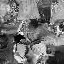
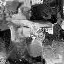
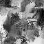
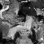
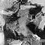
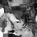
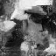
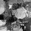

U-Net

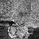
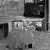
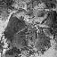
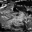
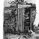
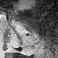
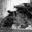
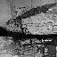

From hereon we can try things like: 
- [Diffusion Posterior Sampling](https://arxiv.org/abs/2209.14687)
- [RED-Diff](https://arxiv.org/pdf/2305.04391)
- [Diff-PIR](https://arxiv.org/pdf/2305.08995)
- [Opt-Diff](https://arxiv.org/pdf/2605.11506)